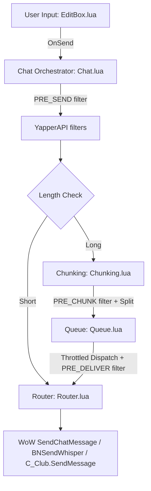

> _This document was generated by AI (GitHub Copilot) and manually reviewed by the author._

# Yapper Architecture Overview

Yapper is a modular, event-driven replacement for the World of Warcraft chat input (EditBox). It sidesteps "taint" issues by using a custom overlay while out of combat and deferring to the standard Blizzard EditBox during secure lockdowns.

## Data & Execution Flow

The typical lifecycle of a chat message in Yapper follows this path:

### Key Components

1.  **EditBox Overlay (`EditBox.lua`)**
    - Manages the visual input frame, channel labels, and input focus.
    - Handles input state (ChatType, Language, Target).
    - Prevents Blizzard's native EditBox from showing by hooking `Show()` and providing its own non-protected overlay.

2.  **Chat Orchestrator (`Chat.lua`)**
    - The central switchboard that decides how a message is handled.
    - Determines if a message type is "splittable" (e.g., Guild, Say, Party).
    - Interfaces with History to save sent messages.

3.  **Chunking Engine (`Chunking.lua`)**
    - Intelligently splits long text into chunks that fit within the byte limit (usually 255 bytes).
    - Preserves item links, currency links, and colour codes across splits.

4.  **Queue System (`Queue.lua`)**
    - Manages the asynchronous delivery of multi-part messages.
    - Implements throttling and confirmation-based sequencing to avoid server kicks.

5.  **Spellchecker (`Spellcheck.lua`)**
    - Real-time background spellcheck with custom dictionaries.
    - Dynamically renders underlines and highlights without breaking EditBox focus.

6.  **Public API (`API.lua`)**
    - Exposes `_G.YapperAPI` with filters (PRE_SEND, PRE_CHUNK, PRE_DELIVER, PRE_EDITBOX_SHOW, PRE_SPELLCHECK) and callbacks (POST_SEND, EDITBOX_SHOW, CONFIG_CHANGED, ICON_GALLERY_SELECT, etc.) for third-party addon integration.

7.  **Icon Gallery (`IconGallery.lua`)**
    - Popup grid of the 8 WoW raid-target icons, triggered by typing `{` in any Yapper-managed edit box.
    - Filterable by icon name (`star`, `skull`, …) or shorthand code (`rt1`…`rt8`).
    - Exposed to external addons via `YapperAPI:ShowIconGallery` / `HideIconGallery` / `GetRaidIconData` and the `ICON_GALLERY_*` callbacks.
    - Loads before `EditBox.lua` so the EditBox handler can reference it immediately.

7.  **Bridges (`Src/Bridges/`)**
    - Compatibility shims for LibGopher/CrossRP, Simply_RP_Typing_Tracker, WIM, and RPPrefix. All bridges consume the public API rather than calling core modules directly.

8.  **Autocomplete (`Autocomplete.lua`) / Multiline (`Multiline.lua`)**
    - Scaffolding for ghost-text word completion and the expanded storyteller editor. Not yet fully wired.

## Dependency Graph

- **Hard Dependencies**: Most modules depend on `Core.lua` for config and `Utils.lua` for logging/printing.
- **Load order (TOC)**: `Core` → `Utils` → `Error` → `Frames` → `Events` → `API` → `Spellcheck` → `IconGallery` → `EditBox` → `Bridges` → `Router` → `Chunking` → `Queue` → `Chat` → `Multiline` → `Autocomplete` → `History` → `Theme` → `Interface`.
- **Logic Stack**: `EditBox.lua` → `Chat.lua` → `Chunking.lua` / `Queue.lua` → `Router.lua`.

## Configuration System

Yapper uses a dual-save system:
- `YapperDB`: Global account-wide settings.
- `YapperLocalConf`: Character-specific overrides.

Settings are merged at runtime in `Core.lua` with `DEFAULTS` being the ground truth for schema.

## Error Handling

Yapper uses a centralised error registry in `Error.lua` for formatted warnings and fatal throws (`YapperTable.Error:Throw`).

| Code | Type | Description |
| :--- | :--- | :--- |
| **`MISSING_INTERFACE`** | **FATAL** | A core UI module or the `PurgeRenderCache` method is missing. |
| **`MISSING_CONFIG`** | **FATAL** | `YapperTable.Config` failed to load or is corrupt. |
| **`MISSING_EVENTS`** | **FATAL** | The event bus (`YapperTable.Events`) is unavailable. |
| **`BAD_ARG`** | Warning | A function received an invalid type (e.g., expected boolean, got nil). |
| **`BAD_PATCH`** | Warning | A compatibility patch for a third-party addon failed to apply. |
| **`UNKNOWN`** | Variable | Catch-all for unexpected state failures. |
