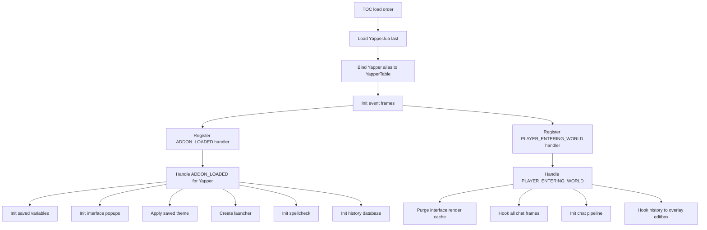
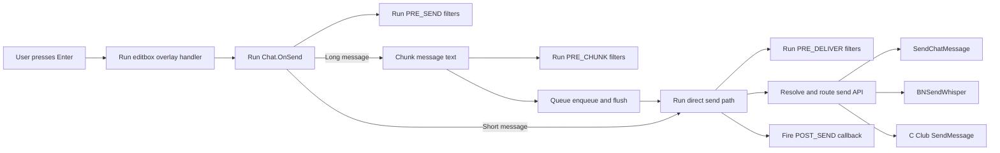
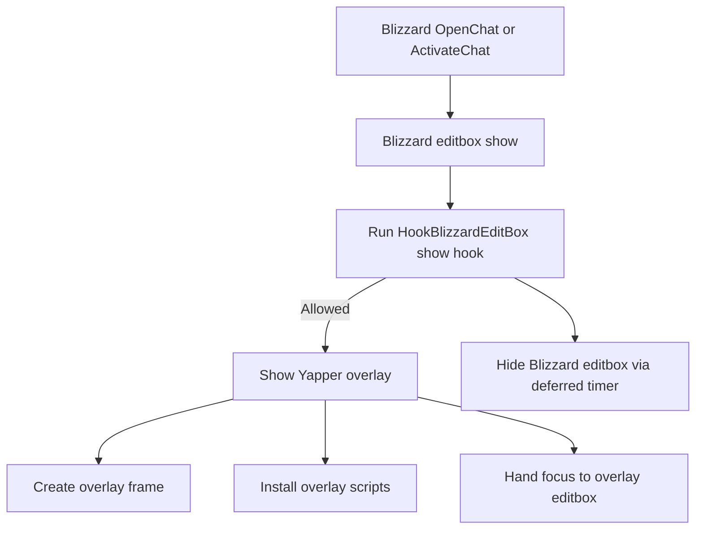
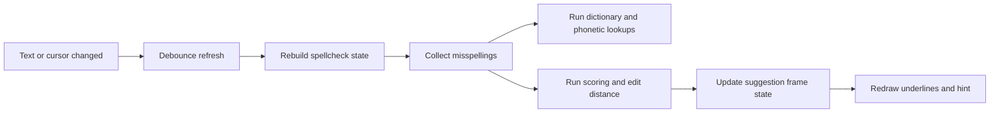

# Architecture map

This page is the runtime map for Yapper at this commit.

Primary load-order source: [`Yapper.toc`](../Yapper.toc).

## Module load map (TOC order)

```text
Src/Core.lua
Src/Utils.lua
Src/Error.lua
Src/Frames.lua
Src/Events.lua
Src/API.lua
Src/Spellcheck.lua
Src/Spellcheck/Dictionary.lua
Src/Spellcheck/YALLM.lua
Src/Spellcheck/UI.lua
Src/Spellcheck/Underline.lua
Src/Spellcheck/Engine.lua
Src/IconGallery.lua
Src/EditBox.lua
Src/EditBox/SkinProxy.lua
Src/EditBox/Overlay.lua
Src/EditBox/Handlers.lua
Src/EditBox/Hooks.lua
Src/EditBoxCompat.lua
Src/Bridges/GopherBridge.lua
Src/Bridges/TypingTrackerBridge.lua
Src/Bridges/RPPrefixBridge.lua
Src/Bridges/WIMBridge.lua
Src/Bridges/ElvUIBridge.lua
Src/Router.lua
Src/Chunking.lua
Src/Queue.lua
Src/Chat.lua
Src/Multiline.lua
Src/Autocomplete.lua
Src/History.lua
Src/Theme.lua
Src/Themes/Blizzard.lua
Src/Interface.lua
Src/Interface/Schema.lua
Src/Interface/Config.lua
Src/Interface/Window.lua
Src/Interface/Widgets.lua
Src/Interface/Pages.lua
Yapper.lua
```

## Boot sequence



Code anchors:

- Boot registration and handlers: [`Yapper.lua#L63-L189`](../Yapper.lua#L63-L189)
- SavedVariables init: [`Src/Core.lua#L359`](../Src/Core.lua#L359)
- Spellcheck init call site: [`Yapper.lua#L135-L137`](../Yapper.lua#L135-L137)
- `PLAYER_ENTERING_WORLD` path: [`Yapper.lua#L149-L169`](../Yapper.lua#L149-L169)

## Runtime component graph

```text
User input / WoW chat events
  ├─ EditBox overlay stack
  │   ├─ EditBox.Overlay / Handlers / Hooks / SkinProxy
  │   ├─ Spellcheck (UI + Underline + Engine + Dictionary + YALLM)
  │   ├─ Autocomplete
  │   └─ Multiline editor
  │
  ├─ Chat pipeline
  │   EditBox -> Chat -> Chunking -> Queue -> Router -> WoW send API
  │
  ├─ Bridges (optional behaviour overlays)
  │   Gopher, TypingTracker, RPPrefix, WIM, ElvUI
  │
  └─ Settings/UI
      Interface + Theme + History + API callbacks/filters
```

## Hot path 1: Send path



Bridge integration points:

- **GopherBridge**: can become active sender path (`Router:Send` delegates to bridge send) ([`Src/Router.lua#L235-L240`](../Src/Router.lua#L235-L240), [`Src/Bridges/GopherBridge.lua#L103`](../Src/Bridges/GopherBridge.lua#L103)).
- **RPPrefixBridge**: pre-send text mutation via API filter ([`Src/Bridges/RPPrefixBridge.lua`](../Src/Bridges/RPPrefixBridge.lua)).
- **TypingTrackerBridge**: overlay focus/send signal callbacks from editbox lifecycle ([`Src/Bridges/TypingTrackerBridge.lua`](../Src/Bridges/TypingTrackerBridge.lua)).
- **WIMBridge**: can suppress editbox open via `PRE_EDITBOX_SHOW` ownership checks ([`Src/Bridges/WIMBridge.lua`](../Src/Bridges/WIMBridge.lua)).
- **ElvUIBridge**: theme sync/reactivity, not in send path payload but in runtime UI lifecycle ([`Src/Bridges/ElvUIBridge.lua`](../Src/Bridges/ElvUIBridge.lua)).

## Hot path 2: Open path



Reentrancy note (issue #21 fix):

- Show hook uses `_inBlizzShowHook` guard and defers focus reclaim via `C_Timer.After(0, ...)` to avoid recursive focus ping-pong with Blizzard `ActivateChat` ([`Src/EditBox/Hooks.lua#L1119-L1283`](../Src/EditBox/Hooks.lua#L1119-L1283)).

## Hot path 3: Spellcheck path



## Detailed subsystem: YALLM learning model

YALLM (`Src/Spellcheck/YALLM.lua`) is a per-locale adaptive layer that adjusts ranking and auto-learns persistent words.

### Storage model

Stored in `_G.YapperDB.SpellcheckLearned[locale]` with on-init migration for legacy flat data:

- `freq[word] = { c, t }` user usage count and last-seen timestamp.
- `bias["typo:correction"] = { c, t, u }` direct correction preferences and utility weight.
- `phBias["phoneticHash:correction"] = { c, t }` generalized phonetic correction memory.
- `negBias["typo:word"] = { c, t, u }` rejected suggestion penalties.
- `auto[word] = { c, t }` repeated uncorrected words pending auto-promotion.
- `total` tracked unique vocabulary size for frequency-cap enforcement.

Code anchors: [`Src/Spellcheck/YALLM.lua#L60-L100`](../Src/Spellcheck/YALLM.lua#L60-L100).

### Learning signals

- Outgoing sends call `RecordUsage` and `RecordIgnored` from the chat path.
- Explicit suggestion acceptance calls `RecordSelection`.
- Implicit correction (manual retyping over misspelling trace) calls `RecordImplicitCorrection`.
- Rejected candidates (e.g. "More..." path) call `RecordRejection`.

Code anchors:

- Send-path learning: [`Src/Chat.lua#L199-L215`](../Src/Chat.lua#L199-L215)
- Implicit correction trigger: [`Src/Spellcheck/Engine.lua#L236-L238`](../Src/Spellcheck/Engine.lua#L236-L238)
- Suggestion/rejection hooks: [`Src/Spellcheck/UI.lua#L869-L962`](../Src/Spellcheck/UI.lua#L869-L962)

### Ranking impact in candidate scoring

`Engine:GetSuggestions` calls `YALLM:GetBonus(candidate, typo, typoPhHash, locale)` and adds the returned score adjustment to base candidate score.

Current bonus components (negative = better rank, positive = penalty):

- Frequency bonus (`freqBonus`) once a word has enough repeated usage.
- Direct typo→correction bias bonus (`biasBonus`) scaled by repetition.
- Phonetic-pattern bias bonus (`phBonus`) scaled by repetition.
- Rejection penalty (`negBias`) to demote repeatedly rejected options.

Code anchors:

- YALLM score composition: [`Src/Spellcheck/YALLM.lua#L381-L419`](../Src/Spellcheck/YALLM.lua#L381-L419)
- Engine integration point: [`Src/Spellcheck/Engine.lua#L695-L696`](../Src/Spellcheck/Engine.lua#L695-L696)

### Guardrails and maintenance

- `IsSaneWord` blocks noisy learning inputs (very short/long tokens, keyboard smash patterns, invalid consonant clusters, optional n-gram sanity).
- Config-backed caps:
  - `YALLMFreqCap`
  - `YALLMBiasCap`
  - `YALLMAutoThreshold`
- `Prune(tableName, limit)` keeps the highest relevance entries using `count * utility / age`.
- `Reset(locale?)` clears learned state globally or per locale.
- Auto-promotion emits `YALLM_WORD_LEARNED` after adding a word into user dictionary.

Code anchors:

- Word sanity checks: [`Src/Spellcheck/YALLM.lua#L113-L147`](../Src/Spellcheck/YALLM.lua#L113-L147)
- Cap accessors and defaults: [`Src/Spellcheck/YALLM.lua#L38-L54`](../Src/Spellcheck/YALLM.lua#L38-L54), [`Src/Core.lua#L209-L212`](../Src/Core.lua#L209-L212)
- Pruning/reset: [`Src/Spellcheck/YALLM.lua#L427-L478`](../Src/Spellcheck/YALLM.lua#L427-L478)
- Auto-learn event emission: [`Src/Spellcheck/YALLM.lua#L357-L370`](../Src/Spellcheck/YALLM.lua#L357-L370), [`Src/API.lua#L183-L185`](../Src/API.lua#L183-L185)

Code anchors:

- Debounce and rebuild: [`Src/Spellcheck/UI.lua#L333-L368`](../Src/Spellcheck/UI.lua#L333-L368)
- Misspelling collection: [`Src/Spellcheck/Engine.lua#L77-L121`](../Src/Spellcheck/Engine.lua#L77-L121)
- Suggestion generation: [`Src/Spellcheck/Engine.lua#L796`](../Src/Spellcheck/Engine.lua#L796)
- Suggestions UI open/refresh: [`Src/Spellcheck/UI.lua#L720-L909`](../Src/Spellcheck/UI.lua#L720-L909)

## SavedVariables layout

## `YapperDB` (account-wide)

- Defaults root and account profile values.
- Owns render cache container (`InterfaceUI`), version stamp, and global profile data.
- Initialised/normalised in [`Src/Core.lua#L382-L446`](../Src/Core.lua#L382-L446).

## `YapperLocalConf` (per-character)

- Character-level overrides.
- Receives defaults, then inherits from `YapperDB` via recursive metatable wiring.
- Becomes live config table (`YapperTable.Config = YapperLocalConf`) in [`Src/Core.lua#L430-L434`](../Src/Core.lua#L430-L434).

## `YapperLocalHistory` (per-character)

- Drafts, undo/redo snapshots, local chat history ring data.
- Initialised in [`Src/Core.lua#L447-L455`](../Src/Core.lua#L447-L455), then used by [`Src/History.lua`](../Src/History.lua).

## Merge/migration behaviour

- `ApplyDefaults` seeds missing keys.
- `SyncParity` removes unknown keys and repairs type mismatches on version bump.
- Version markers:
  - Config: `table.System.VERSION`
  - History: `table.VERSION`
- `LoadSavedVariablesFirst: 1` guarantees this runs before module runtime init hooks.

## LOD dictionary architecture

```mermaid
flowchart TD
    A[Spellcheck:EnsureLocale(locale)] --> B[LoadDictionary(locale) builder path]
    A --> C{Is locale already available?}
    C -- no --> D[Resolve locale addon name]
    D --> E[C_AddOns.LoadAddOn(addon)]
    E --> F[LOD addon loads Engine.lua/Dict_*.lua]
    F --> G[YapperAPI:RegisterLanguageEngine]
    F --> H[YapperAPI:RegisterDictionary]
    H --> I[Spellcheck:RegisterDictionary]
    I --> J[Spellcheck.Dictionaries[locale] populated]
    J --> K[ScheduleLocaleRefresh/Rebuild]
```

Key files:

- Loader and availability checks: [`Src/Spellcheck/Dictionary.lua`](../Src/Spellcheck/Dictionary.lua)
- Public registration bridge: [`Src/API.lua#L817-L875`](../Src/API.lua#L817-L875)
- Example LOD addon registration:
  - [`Dictionaries/Yapper_Dict_en/Engine.lua`](../Dictionaries/Yapper_Dict_en/Engine.lua)
  - [`Dictionaries/Yapper_Dict_en/Dict_enBase.lua`](../Dictionaries/Yapper_Dict_en/Dict_enBase.lua)

## Error handling

Errors are centralised in [`Src/Error.lua`](../Src/Error.lua). Runtime throw path is `YapperTable.Error:Throw(code, ...)` ([`Src/Error.lua#L8`](../Src/Error.lua#L8)).

| Code | Meaning |
|---|---|
| `BAD_STRING` | Malformed string cannot be posted |
| `BAD_ARG` | Function received wrong argument type |
| `EVENT_REGISTER_MISSING_FRAME` | Event registration attempted on missing frame |
| `EVENT_UNREGISTER_MISSING_FRAME` | Event unregistration attempted on missing frame |
| `EVENT_HANDLER_NOT_FUNCTION` | Event handler is not callable |
| `MISSING_UTILS` | `YapperTable.Utils` missing |
| `MISSING_CONFIG` | `YapperTable.Config` missing |
| `MISSING_EVENTS` | `YapperTable.Events` missing |
| `MISSING_FRAMES` | `YapperTable.Frames` missing |
| `MISSING_INTERFACE` | Interface critical function missing during boot |
| `HOOKS_NOT_TABLE` | Frame hooks container invalid |
| `HOOK_NOT_FUNCTION` | Specific hook is not callable |
| `BAD_PATCH` | Compat patch failed |
| `PATCH_MISSING_COMPATLIB` | CompatLib missing for patching |
| `YAPPER_MISSING_COMPATLIB` | CompatLib missing globally |
| `BAD_CHAT_TYPE` | Unsupported chat type in send path |
| `UNKNOWN` | Generic fallback error template |

## Practical mental model

- `Yapper.lua` handles lifecycle and wiring only.
- `EditBox` owns UX and input state.
- `Chat/Chunking/Queue/Router` own delivery mechanics.
- `Spellcheck` is its own subsystem with dictionary LOD + engine + UI layers.
- `Interface/Theme` own configuration surface and visual state.
- `API` is the extension boundary.
